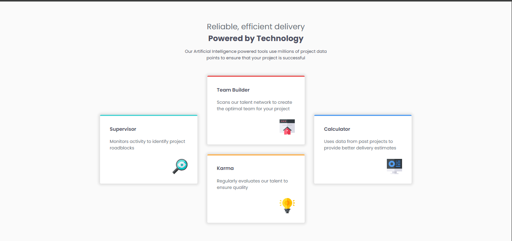

# Frontend Mentor - Four card feature section solution

This is a solution to the [Four card feature section challenge on Frontend Mentor](https://www.frontendmentor.io/challenges/four-card-feature-section-weK1eFYK). Frontend Mentor challenges help you improve your coding skills by building realistic projects. 

## 🎯 Overview

### The challenge

Users should be able to:

- View the optimal layout depending on their device's screen size

### Screenshot

### Links

- Solution URL: 
- Live Site URL: https://jyogita.github.io/Frontend-Mentor-Challenges/Four-Card-Feature-Section-Project-6/

## 🛠 Built with

- Semantic HTML5
- CSS3 (Flexbox)
- Custom properties (CSS variables)
- Google Fonts (Poppins)

## 💡 What I learned

This project helped reinforce my understanding of responsive layout techniques, proper use of semantic tags, and clean UI component styling using Flexbox.

### Useful resources

- [W3Schools](https://www.w3schools.com/) - This website helped me very much with learning about styling and responsive layouts.