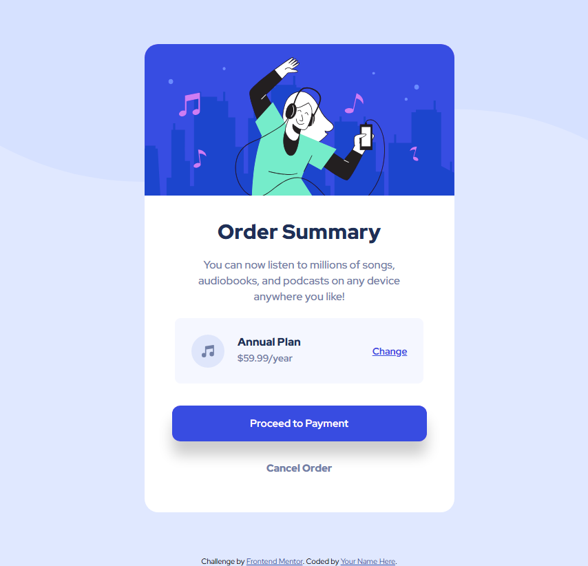

# Frontend Mentor - Blog preview card solution

This is my solution to the [Order summary card challenge on Frontend Mentor](https://www.frontendmentor.io/challenges/order-summary-component-QlPmajDUj). Frontend Mentor challenges help improve your coding skills by building realistic projects.

## 🎯 Overview

### The challenge

Users should be able to:

- View the optimal layout depending on their device's screen size
- See hover states for interactive elements

### Screenshot

### Links

- Solution URL: 
- Live Site URL: https://jyogita.github.io/Frontend-Mentor-Challenges/Order-Summary-Component-Project-5/

## 🛠 Built with

- Semantic HTML5
- CSS3 (Flexbox)
- Mobile-first workflow
- Custom properties (CSS variables)
- Google Fonts (Red Hat Display)

## 💡 What I learned

This project helped reinforce my understanding of responsive layout techniques, proper use of semantic tags, and clean UI component styling using Flexbox.

### Useful resources

- [W3Schools](https://www.w3schools.com/) - This website helped me very much with learning about styling and responsive layouts.