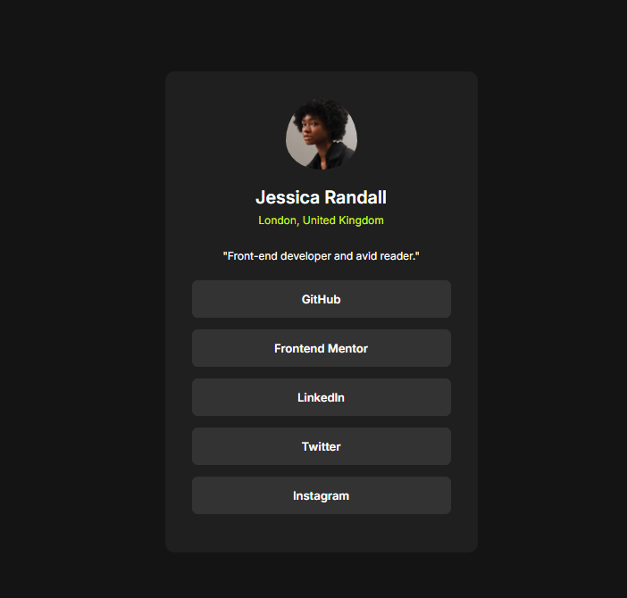

# Frontend Mentor - Social Media Links Solution

This is a solution to the [Social Media Links challenge on Frontend Mentor](https://www.frontendmentor.io/challenges/recipe-page-KiTsR8QQKm). Frontend Mentor challenges help you improve your coding skills by building realistic projects.

## Table of contents

- [Overview](#overview)
  - [Screenshot](#screenshot)
  - [Links](#links)
- [My process](#my-process)
  - [Built with](#built-with)
  - [What I learned](#what-i-learned)
  - [Useful resources](#useful-resources)

## Overview

### Screenshot

### Links

- Solution URL: 
- Live Site URL: 

## My process

### Built with

- CSS custom properties

### What I learned

I've learned about responsive design and how to use CSS custom properties to create a more flexible and consistent style.

### Useful resources

- [W3Schools](https://www.w3schools.com/) - This website helped me very much with learning about styling lists and using tables.